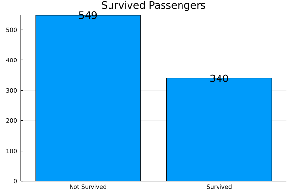
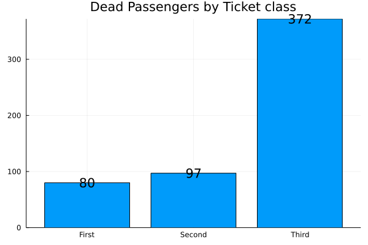
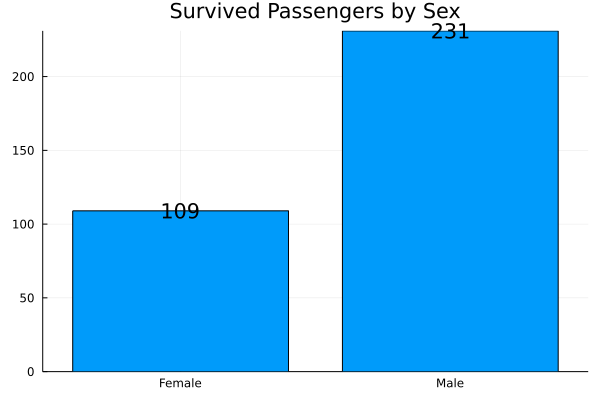
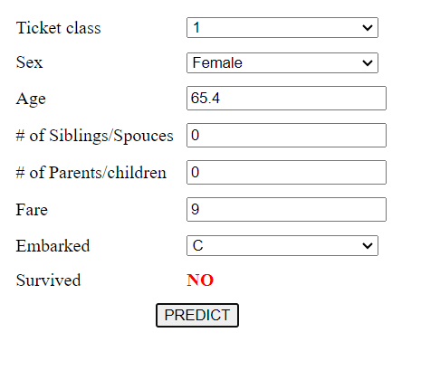
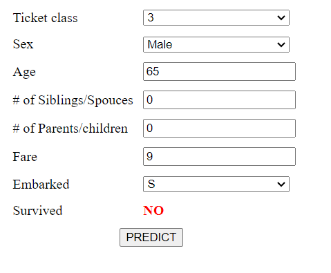
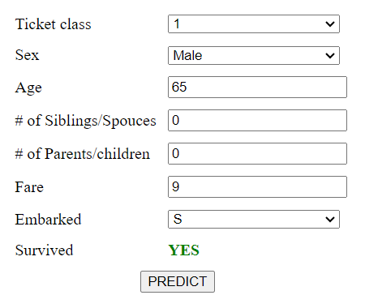

# Titanic - Machine Learning from Disaster
 Deployment of AI model done with Julia on titanic dataset.
## Table of Contents

- [Titanic - Machine Learning from Disaster](#titanic---machine-learning-from-disaster)
  - [Table of Contents](#table-of-contents)
  - [Introduction](#introduction)
    - [Librarries Used](#librarries-used)
  - [Dataset](#dataset)
  - [Preprocessing](#preprocessing)
  - [Insights](#insights)
  - [Modeling](#modeling)
  - [Deployment](#deployment)
  - [Results](#results)

## Introduction
Embarked on an educational project to explore Julia for ML, utilizing Titanic dataset for preprocessing, modeling, and survival prediction.

### Librarries Used 

- `DataFrames`: Used for handling and manipulating tabular data effectively.
- `CSV`: Employed for reading and writing CSV files, a common data format.
- `Plots`: Utilized for creating informative and insightful visualizations.
- `DecisionTree`: Employed for building Random Forests machine learning model.


## Dataset
Kaggle's Titanic ML competition introduces ML beginners to predict passenger survival 

[Titanic-dataset](https://www.kaggle.com/competitions/titanic)


## Preprocessing


- Managing missing data
- Removing unnecessary features
- Addressing categorical data

## Insights
- Death vs survival rate 


- Death by Class


- Suvival rate by gender


## Modeling


Subsequent to data cleansing, a RandomForestClassifer was employed to construct a survival prediction model,

RF hyper parameters

```julia
## set of classification parameters and respective default values
# n_subfeatures: #*number of features to consider at random per split (default: -1, sqrt(# features))
n_subfeatures = -1
# n_trees: #*number of trees to train (default: 10)
n_trees = 50
# partial_sampling: #* fraction of samples to train each tree on (default: 0.7)
partial_sampling = 0.7
# max_depth: #* maximum depth of the decision trees (default: no maximum)
max_depth = -1
# min_samples_leaf: #* the minimum number of samples each leaf needs to have (default: 5)
min_samples_leaf = 12
# min_samples_split: #* the minimum number of samples in needed for a split (default: 2)
min_samples_leaf = 7
# min_purity_increase: #* minimum purity needed for a split (default: 0.0)
min_samples_split = 3
min_purity_increase = 0.0
# keyword rng: #* the random number generator or seed to use (default Random.GLOBAL_RNG)
seed = 3
## multi-threaded forests must be seeded with an `Int`

```

## Deployment
Deployed the Created model into a web application:
`JLD2` that saves and loades new model.
`HTTP` Connects Julia script with a frontend.
`JSON3` To parse the inputs

## Results 
Supporting the insights
- Death occured more among females
- Death occured more among 3d class passengers
- Males had more chance of Survival 
  
sample 1 - Female Death 
-

sample 2 - Male Death
-

sample 3 - male Survival 
-